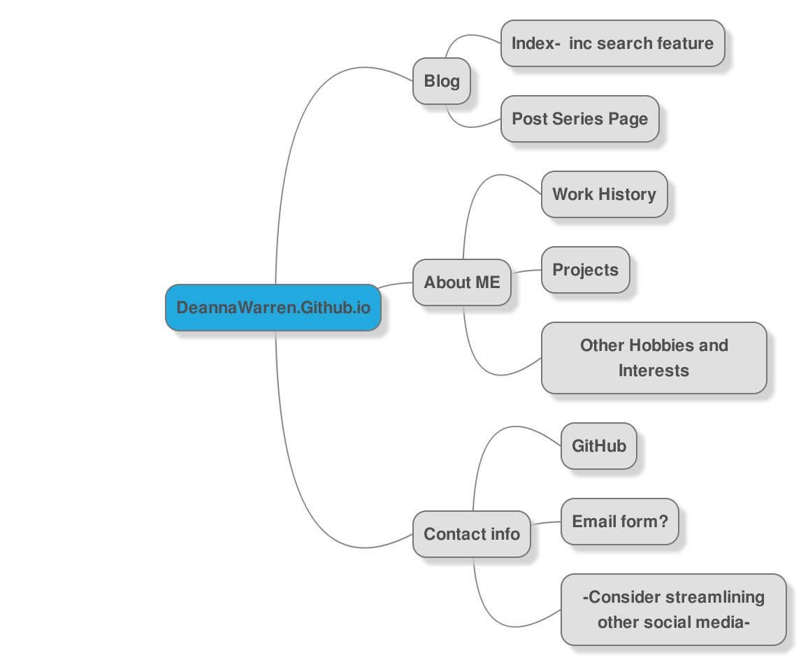

(Sorry my typing is attrocious right now, I'm not feeling very well but I want this done before I finish for the day)

What are the 6 Phases of Web Design?
>The first stage of WD is to get information from the client, or yourself, about the intent of the site, from what sort of content to who it is being aimed at. This will support you in making appropriate choices at all levels of your design.
>The second stage is to plan your site from a broad perspective, such as a site map and perhaps a basic touch of how the flow will go from one page to the other. Sitewide layout as opposed to single page layout.
> The third page is the start of the actual design. Creating a super basic layout of the pages (wireframes? still unclear about this, but I know it's coming up soon so I'm not too worried.). This is a good time to look at color schemes and fonts you may want to use.
>Develop the website as the fourth step. This means making HTML/CSS to create your plans from the last few steps a reality.
> the fifth step  should to test the code and make sure all the pages are linked together properly and work, and that it looks correct. Then you can give it to the client or post it if it is your own site you are going live with.
> The sixth step... I'm blanking out so I'm going to say it's probably to maintain the website unless I missed one earlier. I know there was talk about maintaining it but that might not be a step? But I'm feeling strongly about it so that's what we're going with.

What is your site's primary goal or purpose? What kind of content will your site feature?
>My github feature page will primarily be a page to showcase to future employers and coworkers as a sort of combo card portfolio and about me. I also plan on hosting a technical blog about different things I am learning or working on to keep my knowlege public to people who may want to hire me and also to give back to the community.

What is your target audience's interests and how do you see your site addressing them?
>My current target audience is people who I would want to hire me and obviously the site itself will be a part of my portfolio, but by carefully designing the UX, I can ensure that anyone wanting to look at my skills will come away feeling that I know what I am doing. For non UX projects, I will have another tab for other types, but the UX will be the first thing they see, so it's important.

What is the primary "action" the user should take when coming to your site? Do you want them to search for information, contact you, or see your portfolio? It's ok to have several actions at once, or different actions for different kinds of visitors.
>If someone is coming looking to hire me, I'd like them to go to my about me and then look at my portfolio.
>For people visiting my blog to know more about me, I'm going to have a subsection of by About Me that goes off of the programming track and talks a little about some of my other interests.
>For people coming to look for my blog, I need that to be easy to find.

What are the main things someone should know about design and user experience?
>I think the main thing really is that they really are connected, not just similar. Design should be build around user experience, not the other way around. Some color/font knowledge is good, but mostly as a subset of understanding the needs of the user.

What is user experience design and why is it valuable?
>I'm not going to lie, user experience design is a large part of what I want to work on as a web developer. My husband is blind and uses a screen reader, so I can be very aware that there are many websites that simply don't work well for him. Visual impairment is just one way to change the user experience of the same site dramatically, and by considering the different things that would change the user experience, we can make sure that our site is getting the full response we want from it, whether that is a monetary or social response.

Which parts of the challenge did you find tedious?
>Second day into a migraine, it's all tedious! More seriously, I was feeling a little stuck on relative links. I think I understand it now, but whether I do or not should be pretty obvious by the top of this doc!