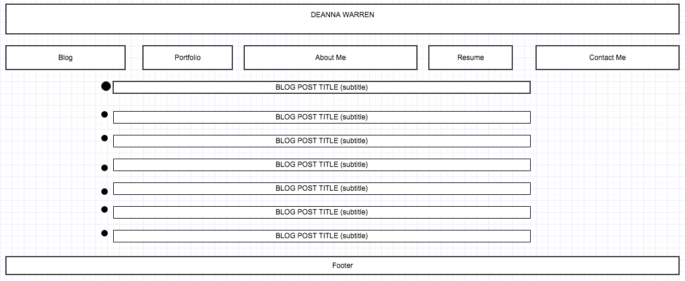

What is a wireframe?
> A wireframe is a simple layout plan made to support coding. See above.

What are the benefits of wireframing?
> The benefits of wireframing are twofold. First of all, you can plan out what your site will look like and then plan site flow based on the site map and the wireframe together. This process will then make coding the HTML much easier.

Did you enjoy wireframing your site?
> I did enjoy it.

Did you revise your wireframe or stick with your first idea?
> I revised it slightly to pull my portfolio and resume forward to the front page for easier access for employers.

What questions did you ask during this challenge? What resources did you find to help you answer them?
>I actually was able to complete the challenge using the information I had been given already.

Which parts of the challenge did you enjoy and which parts did you find tedious?
> I enjoyed the wireboarding, and I actually got really excited because I moved both of the images from my desktop all the way into the IMGS folder in one move, which is the first time I've moved multiple files and the farthest move I've done. It was exciting. I didn't find it tedious once I let go of the desire to make it perfect. That's not the point of a wireboard!
