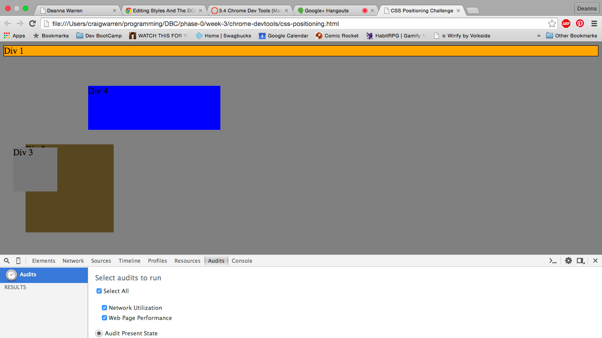
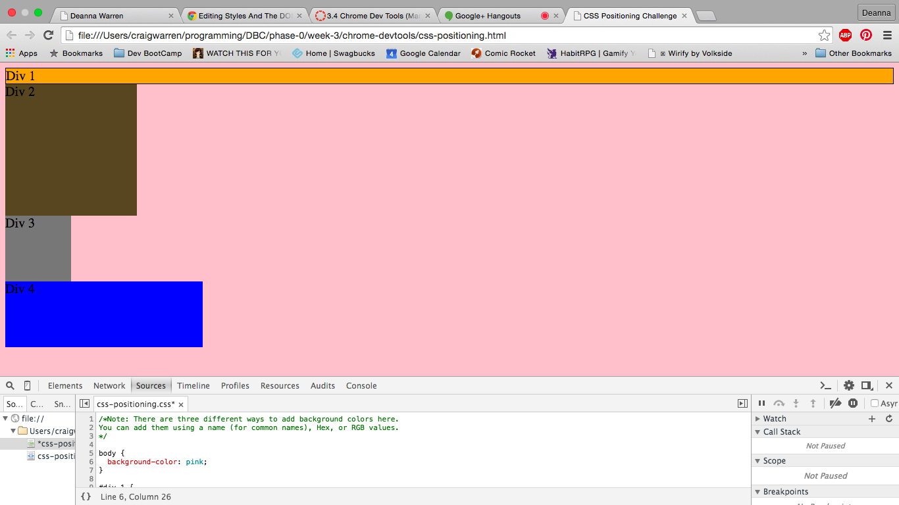
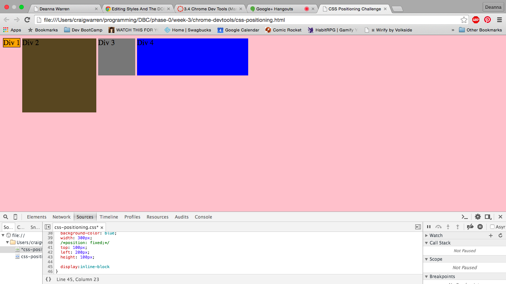
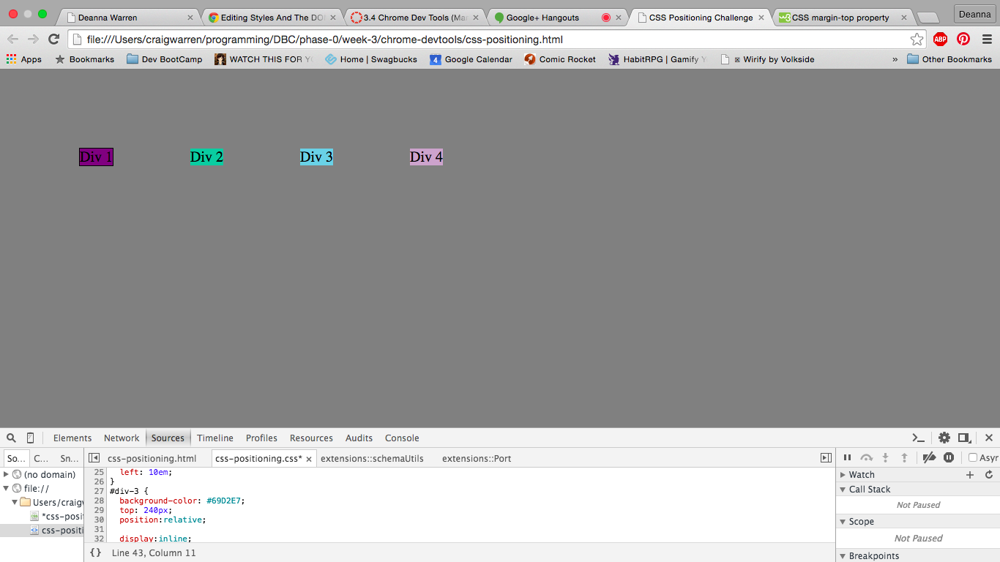
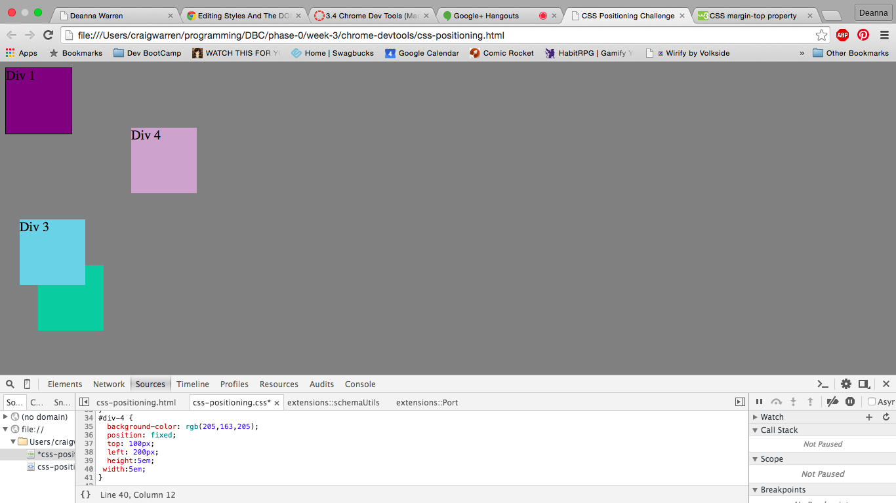
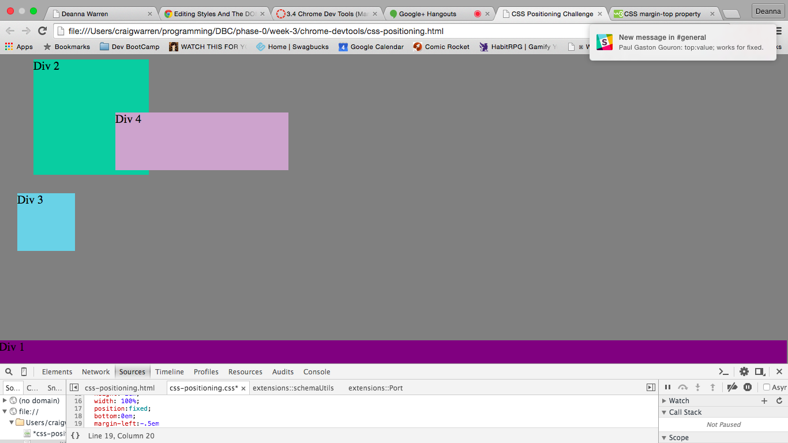
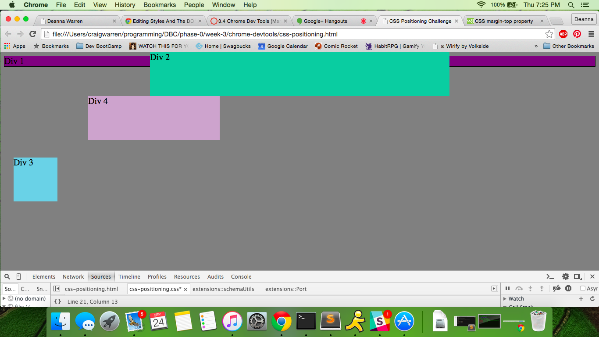
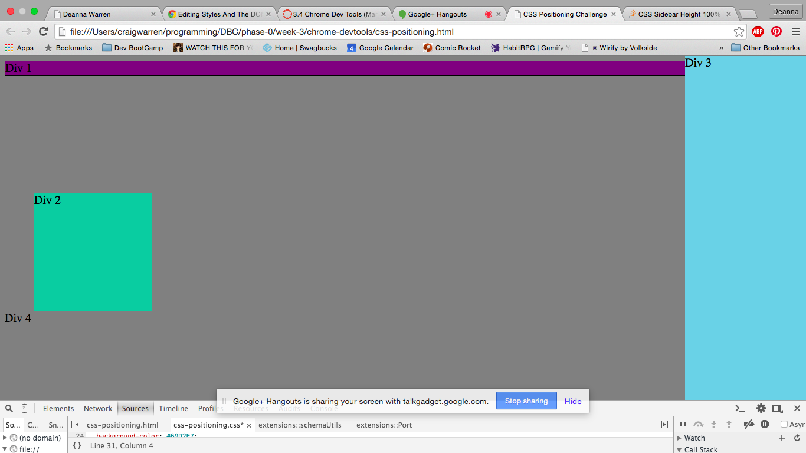
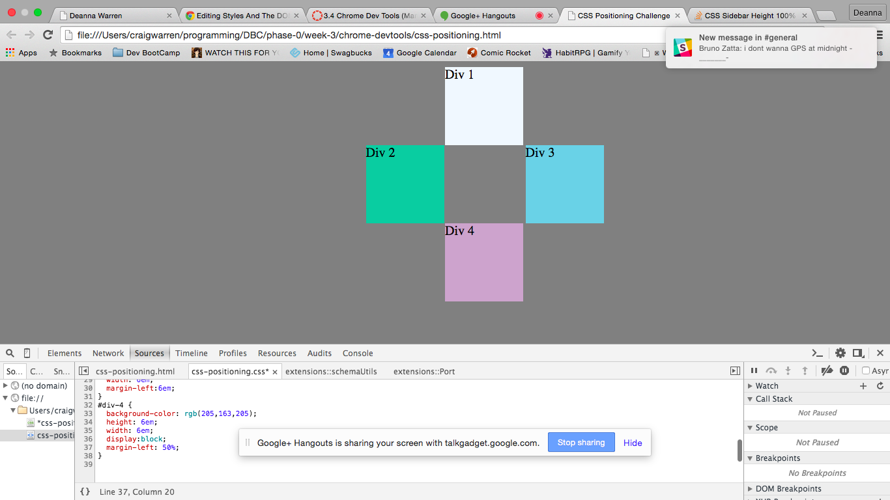

How can you use Chrome's DevTools inspector to help you format or position elements?
>Can be used to visually see changes and choose which changes work because they change live on the screen. It is really easy to fiddle around intuitively. Each line of code can be checked for whether it is needed or what it does.
How can you resize elements on the DOM using CSS?
>I'm not sure if I understand since the DOM shows a map equivilent to a site map but for a single page. I can resize elements by changing the CSS.
What are the differences between Absolute, Fixed, Static, and Relative positioning? Which did you find easiest to use? Which was most difficult?
>Absolute positioning is relative to it's place on the page or nearest parent element.
>
>Fixed positioning is relative to the screen, not the web page so  you can scroll and it will remain in place.
>
>Static positioning is where it would normally lay on the page. It is not affected by things such as top, bottom, left, and right.
>
>Relative positioning is placing the object relative to its static location.
What are the differences between Margin, Border, and Padding?
>Margin- the space outside of the content and any border or padding used- is transparent
>
>Border- the space between margin and padding/content- can be styled
>
>Padding-the space between content and border/margin- is transparent
What was your impression of this challenge overall? (love, hate, and why?)
>eeeeeeeeeh. I don't love it? but I don't hate it? I'm glad it was a pairing session so that we were able to work together to find answers, although for #4 we had to reach out for help when we got stuck. We were on the right track, but couldn't get the elements away from the top.