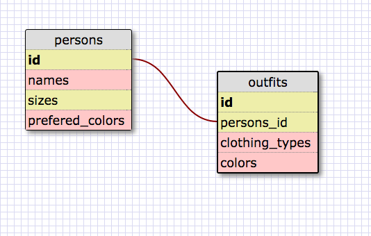

1. SELECT * FROM states;

2. SELECT * FROM regions;

3. SELECT state_name, population FROM states;

4. SELECT state_name, population FROM states ORDER BY population DESC;

5. SELECT state_name FROM states WHERE region_id = 7;

6. SELECT  state_name, population_density FROM states WHERE population_density > 50 ORDER BY population_density;

7. SELECT state_name FROM states WHERE population > 1000000 AND population < 1500000;

8. SELECT state_name, region_id FROM states ORDER BY region_id;

9. SELECT region_name FROM regions WHERE region_name LIKE '%Central';

10. SELECT regions.region_name, states.state_name FROM states JOIN regions ON states.region_id=regions.id;

---

---

1.What are databases for?
  *Databases are for storing data
2.What is a one-to-many relationship?
  *A one to many relationship is when one single item can be linked to other items at more than a one to one ratio.
3.What is a primary key? What is a foreign key? How can you determine which is which?
  *A primary key is the key that provides a single unique data for each instance or row. A foreign key is a column that matches the primary key but is in a different table. This is used to link tables together.
4.How can you select information out of a SQL database? What are some general guidelines for that?
  *see above. I did a whole lot of it. Keywords are capitalized, among other things.
