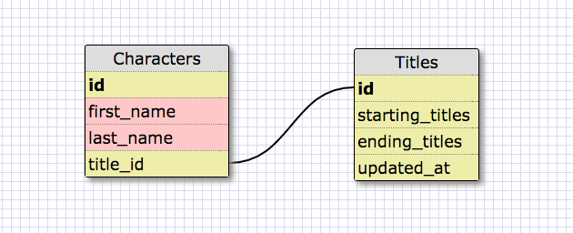
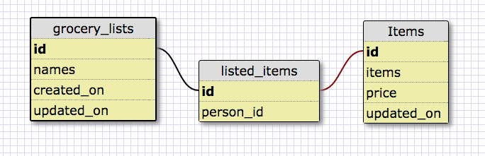

This is a one to one schema of Wheel of Time characters and their respective titles. One character can have many titles, but any titles are only applicable to them, and are best stored as one long title. Many characters have no title, and some have a title at the beginning or end, and gain or lose them. 14 books is an awful lot to maintain a title after all. Therefore one character has one set of titles each for the beginning and end of the series. 

<ol>
  <li>What is a one-to-one database?
    
A one on one database is a database that links two items that only link to each other. 
</li>
  <li>When would you use a one-to-one database? (Think generally, not in terms of the example you created).
    
  This is mostly useful when a set of data is going to be leave a lot of NULL spaces on a table, and therefore can have that section placed in it's own table as needed. 
</li>
  <li>What is a many-to-many database?
    
 A many to many database is when one piece of data can connected to many pieces of data, and be referenced by many data points in return.  
</li>
  <li>When would you use a many-to-many database? (Think generally, not in terms of the example you created).
    
  This is good for things like a group of people and the organizations they belong to.  
</li>
  <li>What is confusing about database schemas? What makes sense?
    
  It makes sense to me.  
</li>
</ol>